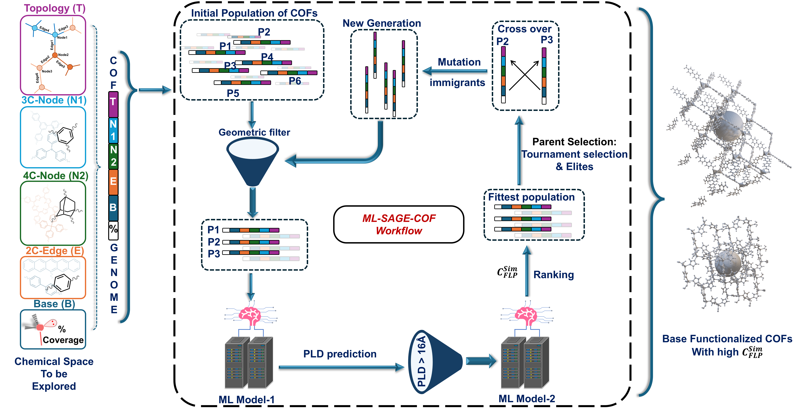

# ML-AGE-COF-Protocol

## Machine Learning–Assisted Genetic Exploration of Base-Functionalized COFs for In Situ FLP Formation

---

  

---

## Overview

ML-AGE-COF is a machine learning–surrogate assisted genetic exploration protocol for discovering base-functionalized COFs capable of stabilizing complementary Lewis acids and forming in situ FLP environments.

The framework integrates:

- Topology-driven genome construction  
- Structural feasibility filtering  
- ML-based pore size prediction  
- FLP capacity estimation  
- Genetic algorithm–driven evolutionary optimization  

For the complete execution sequence of all scripts, refer to:

📄 `pipeline_execution_order.md`

---

## Required Software

Before running the workflow, install and configure the following tools:

1. **Pormake** – COF construction  
2. **Zeo++** – Voronoi void network analysis  
3. **lammps_interface** – CIF → LAMMPS conversion  
4. **LAMMPS** – Geometry optimization  
5. **ASE (Atomic Simulation Environment)** – Structure handling  

Ensure all executables are accessible in your system PATH.

---

## Repository Structure

### `genetic_algorithm_code`
Contains scripts for GA execution including mutation, crossover, selection, and ranking.

### `ml_model_files`
Contains trained ML model files and associated metadata.

### `scripts`
Contains Python scripts for:

- COF sampling  
- Structural filtering  
- LAMMPS preparation  
- Zeo++ analysis  
- FLP capacity computation  
- Metadata construction  

### `docs`
Contains markdown documentation including:

- `pipeline_execution_order.md`

### `features_csv_files`
Raw feature CSV files for building block molecules used in ML dataset construction.

### `structure_xyz`
XYZ files of building blocks used for COF construction.

---

## Pipeline Summary

COF Sampling  
→ COF Construction  
→ Structural Filtering  
→ LAMMPS Optimization  
→ Zeo++ Void Analysis  
→ Global Property Extraction  
→ FLP Capacity Calculation  
→ ML Metadata Construction  
→ Genetic Algorithm Evolution  

---

